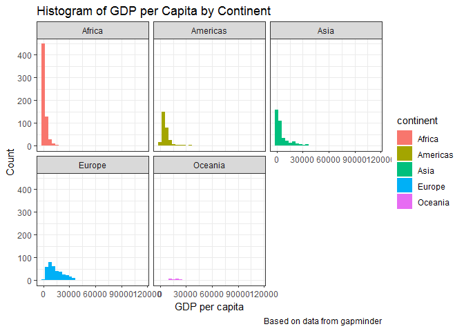

R Markdown
----------

This is the R Markdown document for hw303, which is a continuation of
hw02 - further exploring the gapminder dataset. To explore the data this
time around, we will be using the
[*tidyverse*](https://www.tidyverse.org/packages/) package, which
includes the *dplyr* and *ggplot2* package.  

Open the tidyverse and gapminder Package
----------------------------------------

    # install.packages('tidyverse')
    # install.packages('gapminder')

    library(tidyverse)
    library(gapminder)

 

Task Menu
---------

**The following three topics will be explored in-depth:**

-   Maximum and minimum of GDP per capita for all continents.
-   Spread of GDP per capita within the continents.
-   Change in life expectancy over time for different continents.

For each task, data manipulation will be conducted to isolate our
analysis (*dplyr*) and visual plots will be provided (*ggplot2*)  

Maximum and Minimum of GDP per Capita for All Continents.
---------------------------------------------------------

To create a table summarizing the minimum and maximum GDP per capita
values, we will use the *summarize* function to create new columns
(*MinGDPpercap* and *MaxGDPpercap* for storing minimum and maximum GDP
per capita values), and within this summarize function we will use the
*min* and *max* function to obtain the minimum and maximum GDP per
capita values from the gapminder dataset.

    # Create table displaying minimum, maximum, range, and max/min relativeness of GDP per capita for each continent
    gapminder %>%
        select(continent, gdpPercap) %>% # continent and gdpPercap: our variables of interest
        group_by(continent) %>% # for each continent:
        summarize(MinGDPpercap = min(gdpPercap), # store min gdpPercap values into this variable
                  MaxGDPpercap = max(gdpPercap), # store max gdpPercap values into this variable
                  Range = MaxGDPpercap - MinGDPpercap, # range: max subtract min gdpPercap values
                  Relative = MaxGDPpercap/MinGDPpercap) %>% # how max compares relatively to min
    knitr::kable(caption = "This table summarizes the minimum and maximum values of GDP per capita for all continents") # display in table with additional formatting

<table>
<caption>This table summarizes the minimum and maximum values of GDP per capita for all continents</caption>
<thead>
<tr class="header">
<th align="left">continent</th>
<th align="right">MinGDPpercap</th>
<th align="right">MaxGDPpercap</th>
<th align="right">Range</th>
<th align="right">Relative</th>
</tr>
</thead>
<tbody>
<tr class="odd">
<td align="left">Africa</td>
<td align="right">241.1659</td>
<td align="right">21951.21</td>
<td align="right">21710.05</td>
<td align="right">91.021218</td>
</tr>
<tr class="even">
<td align="left">Americas</td>
<td align="right">1201.6372</td>
<td align="right">42951.65</td>
<td align="right">41750.02</td>
<td align="right">35.744279</td>
</tr>
<tr class="odd">
<td align="left">Asia</td>
<td align="right">331.0000</td>
<td align="right">113523.13</td>
<td align="right">113192.13</td>
<td align="right">342.970190</td>
</tr>
<tr class="even">
<td align="left">Europe</td>
<td align="right">973.5332</td>
<td align="right">49357.19</td>
<td align="right">48383.66</td>
<td align="right">50.699032</td>
</tr>
<tr class="odd">
<td align="left">Oceania</td>
<td align="right">10039.5956</td>
<td align="right">34435.37</td>
<td align="right">24395.77</td>
<td align="right">3.429956</td>
</tr>
</tbody>
</table>

    # A simpler way to obtain min and max values for gdpPercap, for our own interests   
    tapply(gapminder$gdpPercap, gapminder$continent, range) 

    ## $Africa
    ## [1]   241.1659 21951.2118
    ## 
    ## $Americas
    ## [1]  1201.637 42951.653
    ## 
    ## $Asia
    ## [1]    331.0 113523.1
    ## 
    ## $Europe
    ## [1]   973.5332 49357.1902
    ## 
    ## $Oceania
    ## [1] 10039.60 34435.37

From the table we observe above, Africa and Asia are very close in terms
of minimum GDP per capita. However, the difference between the minimum
to maximum is much larger for Asia - with a difference of ~113191 in GDP
per capita compared to the difference between the minimum and maximum
seen for the African continent (range ~ 21710).  

The Americas and Europe have similar minimum and maximum values for GDP
per capita, as we can see by their minimum, maximum, and range values.
Oceania has the highest minimum GDP per capita value by far out of the 5
continents available, however the maximum GDP per capita coming out of
this region is the second lowest - only higher than the maximum value in
Africa.  

When comparing relativeness between the minimum and maximum values in
GDP per capita, Asia has the largest by far (*maximum is ~343 times
larger than minimum GDP per capita in this region*) - as we would expect
after our observations earlier. Africa surprisingly comes second place
in this aspect (*maximum is ~91 times larger than minimum GDP per capita
in this region*), but this may be due to the fact that the minimum value
of GDP per capita for a country in this region is very low, so the
country with the largest value in GDP per capita in this continent will
be very large relative to it but it does not mean it is large compared
to other max values seen from other continents.  

Lets look at some plots for visualizing minimum and maximum GDP per
capita values for each continent:

    # Create a scatter of GDP per capita for each continent
    gapminder %>%
        group_by(continent) %>%
        ggplot(aes(continent, gdpPercap)) + 
        # plot GDP per capita against continent
        geom_point(aes(color=continent), alpha = 1) + 
        # create a scatter and color code the points by continent
        labs(title = "Scatterplot of GDP per Capita by Continent", y = "GDP per capita", 
             x ="Continent",caption = "Based on data from gapminder", colour = "Continent") + 
        # label graph
        theme_bw() # give a white background to the graph

    # Create a line plot from min and max values of GDP per capita for each continent
    gapminder %>%
        group_by(continent) %>%
        ggplot(aes(continent, gdpPercap)) + 
        # plot GDP per capita against continent
        geom_line(aes(color=continent), alpha = 1) +
        # create a line plot going through all values of GDP per cap for each continent, color         coded by continent
        labs(title = "Line Plot of GDP per Capita by Continent", y = "GDP per capita", 
             x ="Continent",caption = "Based on data from gapminder", colour = "Continent") + 
        # label graph
        theme_bw() # give a white background to the graph

 

Overall, the visuals look pretty boring. The scatter shows where the GDP
per capita values are generally bunched together, while the line plot
shows the "distance" between the minimum and maximum value - basically
giving us the range. Visuals for just focussing on minimum and maximum
values can be very limited, looking at the distribution of GDP per
capita values in each continent and making plots based on this would be
more appealing. Hence in the next section of my task list, I will focus
on the *spread of GDP per capita within the continents.*

Spread of GDP per capita within the continents.
-----------------------------------------------

To get things started, lets have a look at the spread of GDP per capita
for each continent. In table form, we can look at the quartiles,
interquartile range (IQR) and mean. I will also include range, minimum
and maximum values in the same table so this table can be treated as an
expansion of the min/max table we saw in the previous section.

    # Create table to summarize distribution of GDP per capita values by continent
    gapminder %>%
        select(continent, gdpPercap) %>% # continent and gdpPercap: our variables of interest
        group_by(continent) %>% # for each continent:
        summarize(MinGDPpercap = min(gdpPercap), # store min gdpPercap values into this variable
                  Q1 = summary(gdpPercap)[2], # 1st quartile
                  Q2 = summary(gdpPercap)[3], # median
                  Mean= mean(gdpPercap), # mean   
                  Q3 = summary(gdpPercap)[5], # third quartile
                  MaxGDPpercap = max(gdpPercap), # store max gdpPercap values into this variable
                  IQR = summary(gdpPercap)[5] - summary(gdpPercap)[2], # Interquartile range
                  Range = MaxGDPpercap - MinGDPpercap, # range: max subtract min gdpPercap values
                  Relative = MaxGDPpercap/MinGDPpercap) %>% # how max compares relatively to min
    knitr::kable(caption = "This table summarizes the spread of GDP per capita for all continents") # display in table with additional formatting

<table>
<caption>This table summarizes the spread of GDP per capita for all continents</caption>
<thead>
<tr class="header">
<th align="left">continent</th>
<th align="right">MinGDPpercap</th>
<th align="right">Q1</th>
<th align="right">Q2</th>
<th align="right">Mean</th>
<th align="right">Q3</th>
<th align="right">MaxGDPpercap</th>
<th align="right">IQR</th>
<th align="right">Range</th>
<th align="right">Relative</th>
</tr>
</thead>
<tbody>
<tr class="odd">
<td align="left">Africa</td>
<td align="right">241.1659</td>
<td align="right">761.2</td>
<td align="right">1192</td>
<td align="right">2193.755</td>
<td align="right">2377</td>
<td align="right">21951.21</td>
<td align="right">1615.8</td>
<td align="right">21710.05</td>
<td align="right">91.021218</td>
</tr>
<tr class="even">
<td align="left">Americas</td>
<td align="right">1201.6372</td>
<td align="right">3428.0</td>
<td align="right">5466</td>
<td align="right">7136.110</td>
<td align="right">7830</td>
<td align="right">42951.65</td>
<td align="right">4402.0</td>
<td align="right">41750.02</td>
<td align="right">35.744279</td>
</tr>
<tr class="odd">
<td align="left">Asia</td>
<td align="right">331.0000</td>
<td align="right">1057.0</td>
<td align="right">2647</td>
<td align="right">7902.150</td>
<td align="right">8549</td>
<td align="right">113523.13</td>
<td align="right">7492.0</td>
<td align="right">113192.13</td>
<td align="right">342.970190</td>
</tr>
<tr class="even">
<td align="left">Europe</td>
<td align="right">973.5332</td>
<td align="right">7213.0</td>
<td align="right">12080</td>
<td align="right">14469.476</td>
<td align="right">20460</td>
<td align="right">49357.19</td>
<td align="right">13247.0</td>
<td align="right">48383.66</td>
<td align="right">50.699032</td>
</tr>
<tr class="odd">
<td align="left">Oceania</td>
<td align="right">10039.5956</td>
<td align="right">14140.0</td>
<td align="right">17980</td>
<td align="right">18621.609</td>
<td align="right">22210</td>
<td align="right">34435.37</td>
<td align="right">8070.0</td>
<td align="right">24395.77</td>
<td align="right">3.429956</td>
</tr>
</tbody>
</table>

An interesting observation is that for all continents, the mean is
larger than median (Q2). Usually this means the distribution of GDP per
capita will be skewed to the right, meaning each continent tends to have
more lower values of GDP per capita and lesser counts of high GDP per
capita (or even large value outliers). Asia has a large difference
between mean (~7902) and median (~2647), hence when we plot the spread
for this region, we expect a heavy tail to the right (more likely to
have large outliers).

  Lets visualize the spread through plots. A boxplot and histogram
will be used to display the spread of GDP per capita for each continent.
I will display a histogram plot with the spread for all countries to
give you a general picture of the spread, before showing spread by
continent in a separate histogram and an additional boxplot.

    # Histogram of GDP per capita for whole dataset
    ggplot(gapminder, aes(gdpPercap)) + 
        geom_histogram(aes(fill=continent)) + # Color code counts in the distribution by continent
        labs(title = "Histogram of GDP per Capita for all Countries", y = "Count", 
             x ="GDP per capita",caption = "Based on data from gapminder", fill = "Continent") + 
        # label graph
        theme_bw() # give a white background to the plot

    # Histogram of GDP per capita by continent
    ggplot(gapminder, aes(gdpPercap)) +
        facet_wrap(~continent) +  # this breaks into histograms showing distribution by continent
        geom_histogram(aes(fill=continent)) + 
        labs(title = "Histogram of GDP per Capita by Continent", y = "Count", 
             x ="GDP per capita",caption = "Based on data from gapminder") + 
        # label graph
        theme_bw() # give a white background to the plot

    # Boxplot of GDP per capita by continent
    gapminder %>%
        group_by(continent) %>%
        ggplot(aes(continent, gdpPercap)) + # interested in comparing GDP per cap by continent
        geom_boxplot(aes(fill=continent)) + # color code boxplots according to continent
        labs(title = "Boxplot of GDP per Capita by Continent", y = "GDP per capita", 
             x ="Continent",caption = "Based on data from gapminder") + 
        # label graph
        theme_bw() # give a white background to the plot

As observed in the histogram for all countries, the tail was heavily
skewed to the right. This means we are dealing with some large outliers,
however there isn't enough of these larger outliers to tell us which
continents have countries with these outlier GDP per capita values. The
histogram shows Africa have the most countries with low GDP per capita,
with the counts in the distribution very close to the left side of the
plot. A similar observation is made for Asia, however from previous
observations we do expect some large outlier values, which may explain
the heavy skew to the right but with low distribution. Europe and
Oceania has a consistent spread from low to high GDP per Capita.

  The histograms isolating distribution by continent show Asia and
Europe having a relative larger spread in the distribution of GDP per
capita, whereas Oceania, the Americas, and Africa have a smaller spread.
We could shrink each axis of the histogram to have a better view of the
spread, however for comparison purposes it is preferred to keep the axis
scales the same for all continents.

  The boxplots show we have many outlier values (as highlighted by
the dots outside of the boxplots). Asia in particular have a few extreme
outliers, which explains the heavy right-sided tail in the histograms
but with very little counts - hence we cannot observe this in the graphs
by our eyes.

  A way to have a clearer comparitive observation of the
distribution by continent, we can choose to filter out these extreme
outlier values from Asia - giving us a smaller axis scale for a more
visually appealing plot. This is generally not recommended, but just for
curiosity we can see how the plots look differently without the extreme
values.

    # Filter out extreme GDP per capita values (< 60000 was chosen, cutoff chosen because we lose only 5 extreme data points)

    # Boxplot (by continent)
    gapminder %>%
        filter(gdpPercap < 60000) %>% 
        # visually inspected boxplots and decided a cut-off < 60000 would be appropriate
        group_by(continent) %>%
        ggplot(aes(continent, gdpPercap)) + # variables of interest
        geom_boxplot(aes(colour=continent)) + # color code boxplots according to continent
        labs(title = "Boxplot of GDP per Capita by Continent with Extreme Outliers Removed", 
             y = "GDP per capita", 
             x ="Continent",caption = "Based on data from gapminder, GDP per capita < 60000") + 
        # label graph
        theme_bw() # give a white background to the plot

    # Filter gapminder to exclude entries with GDP per capita 60000 or higher
    gmfilter <- subset(gapminder, gdpPercap < 60000) # Lost 5 observations

    # Histogram (for all countries)
    ggplot(gmfilter, aes(gdpPercap)) +
        geom_histogram(aes(fill=continent)) + # color code counts by continent
        labs(title = "Histogram of GDP per Capita for all Countries, with Extreme Outliers         
            Removed", y = "Count", x ="GDP per capita", 
            caption = "Based on gapminder, GDP per capita < 60000") +
        # label graph
        theme_bw() # give a white background to the plot

    # Histogram (by continent)
    ggplot(gmfilter, aes(gdpPercap)) +
        facet_wrap(aes(continent)) +  # breaks into histograms showing distribution by continent
        geom_histogram(aes(fill=continent)) + # color code by continent
        labs(title = "Histogram of GDP per Capita by Continent, with Extreme Outliers", 
             y = "Count", x ="GDP per capita",
             caption = "Based on gapminder, GDP per capita < 60000") + 
        # label graph
        theme_bw() # give a white background to the plot

Just by removing 5 extreme outlier points, our plots were much more
visually appealing. Reducing the x-axis scale to between 0 to 60000
provided a better outlook of what the spread and distribution is like by
continent and for all countries.

Change in Life Expectancy Over Time
-----------------------------------

For change in life expectancy over time, I am interested to see how life
expectancy change every time point (ie. change every 4 years, compare
current timepoint to previous timepoint, etc).

    # add growth variable to orignal dataset, detailing change in lifeExp by every 4 years
    gm_LE.1 <- mutate(gapminder, change = lifeExp - lag(lifeExp)) 

    # for entries in 1952, growth = 'NA' - this is our first entry so growth cannot be calculated
    gm_LE.2 <- within(gm_LE.1, change[year == 1952] <- NA)

    # Change in mean life expectancy compared to previous 4 year timepoint
    gm_LE.2 %>%
        select(continent, lifeExp, pop, year, change) %>% # variables of interest
        group_by(continent, year) %>% # for each continent and year
        summarize(MeanLE = mean(lifeExp), # Create mean life expectancy for each year, continent
                  MeanChange = mean(change)) %>% # Calculate avg change in life Exp every 4 years                                                 for each continent
        knitr::kable(caption = "This table summarizes the mean change in life expectancy every 4   
                     years for each continent") # display in table with additional formatting

<table>
<caption>This table summarizes the mean change in life expectancy every 4 
years for each continent</caption>
<thead>
<tr class="header">
<th align="left">continent</th>
<th align="right">year</th>
<th align="right">MeanLE</th>
<th align="right">MeanChange</th>
</tr>
</thead>
<tbody>
<tr class="odd">
<td align="left">Africa</td>
<td align="right">1952</td>
<td align="right">39.13550</td>
<td align="right">NA</td>
</tr>
<tr class="even">
<td align="left">Africa</td>
<td align="right">1957</td>
<td align="right">41.26635</td>
<td align="right">2.1308462</td>
</tr>
<tr class="odd">
<td align="left">Africa</td>
<td align="right">1962</td>
<td align="right">43.31944</td>
<td align="right">2.0530962</td>
</tr>
<tr class="even">
<td align="left">Africa</td>
<td align="right">1967</td>
<td align="right">45.33454</td>
<td align="right">2.0150962</td>
</tr>
<tr class="odd">
<td align="left">Africa</td>
<td align="right">1972</td>
<td align="right">47.45094</td>
<td align="right">2.1164038</td>
</tr>
<tr class="even">
<td align="left">Africa</td>
<td align="right">1977</td>
<td align="right">49.58042</td>
<td align="right">2.1294808</td>
</tr>
<tr class="odd">
<td align="left">Africa</td>
<td align="right">1982</td>
<td align="right">51.59287</td>
<td align="right">2.0124423</td>
</tr>
<tr class="even">
<td align="left">Africa</td>
<td align="right">1987</td>
<td align="right">53.34479</td>
<td align="right">1.7519231</td>
</tr>
<tr class="odd">
<td align="left">Africa</td>
<td align="right">1992</td>
<td align="right">53.62958</td>
<td align="right">0.2847885</td>
</tr>
<tr class="even">
<td align="left">Africa</td>
<td align="right">1997</td>
<td align="right">53.59827</td>
<td align="right">-0.0313077</td>
</tr>
<tr class="odd">
<td align="left">Africa</td>
<td align="right">2002</td>
<td align="right">53.32523</td>
<td align="right">-0.2730385</td>
</tr>
<tr class="even">
<td align="left">Africa</td>
<td align="right">2007</td>
<td align="right">54.80604</td>
<td align="right">1.4808077</td>
</tr>
<tr class="odd">
<td align="left">Americas</td>
<td align="right">1952</td>
<td align="right">53.27984</td>
<td align="right">NA</td>
</tr>
<tr class="even">
<td align="left">Americas</td>
<td align="right">1957</td>
<td align="right">55.96028</td>
<td align="right">2.6804400</td>
</tr>
<tr class="odd">
<td align="left">Americas</td>
<td align="right">1962</td>
<td align="right">58.39876</td>
<td align="right">2.4384800</td>
</tr>
<tr class="even">
<td align="left">Americas</td>
<td align="right">1967</td>
<td align="right">60.41092</td>
<td align="right">2.0121600</td>
</tr>
<tr class="odd">
<td align="left">Americas</td>
<td align="right">1972</td>
<td align="right">62.39492</td>
<td align="right">1.9840000</td>
</tr>
<tr class="even">
<td align="left">Americas</td>
<td align="right">1977</td>
<td align="right">64.39156</td>
<td align="right">1.9966400</td>
</tr>
<tr class="odd">
<td align="left">Americas</td>
<td align="right">1982</td>
<td align="right">66.22884</td>
<td align="right">1.8372800</td>
</tr>
<tr class="even">
<td align="left">Americas</td>
<td align="right">1987</td>
<td align="right">68.09072</td>
<td align="right">1.8618800</td>
</tr>
<tr class="odd">
<td align="left">Americas</td>
<td align="right">1992</td>
<td align="right">69.56836</td>
<td align="right">1.4776400</td>
</tr>
<tr class="even">
<td align="left">Americas</td>
<td align="right">1997</td>
<td align="right">71.15048</td>
<td align="right">1.5821200</td>
</tr>
<tr class="odd">
<td align="left">Americas</td>
<td align="right">2002</td>
<td align="right">72.42204</td>
<td align="right">1.2715600</td>
</tr>
<tr class="even">
<td align="left">Americas</td>
<td align="right">2007</td>
<td align="right">73.60812</td>
<td align="right">1.1860800</td>
</tr>
<tr class="odd">
<td align="left">Asia</td>
<td align="right">1952</td>
<td align="right">46.31439</td>
<td align="right">NA</td>
</tr>
<tr class="even">
<td align="left">Asia</td>
<td align="right">1957</td>
<td align="right">49.31854</td>
<td align="right">3.0041503</td>
</tr>
<tr class="odd">
<td align="left">Asia</td>
<td align="right">1962</td>
<td align="right">51.56322</td>
<td align="right">2.2446788</td>
</tr>
<tr class="even">
<td align="left">Asia</td>
<td align="right">1967</td>
<td align="right">54.66364</td>
<td align="right">3.1004170</td>
</tr>
<tr class="odd">
<td align="left">Asia</td>
<td align="right">1972</td>
<td align="right">57.31927</td>
<td align="right">2.6556291</td>
</tr>
<tr class="even">
<td align="left">Asia</td>
<td align="right">1977</td>
<td align="right">59.61056</td>
<td align="right">2.2912873</td>
</tr>
<tr class="odd">
<td align="left">Asia</td>
<td align="right">1982</td>
<td align="right">62.61794</td>
<td align="right">3.0073830</td>
</tr>
<tr class="even">
<td align="left">Asia</td>
<td align="right">1987</td>
<td align="right">64.85118</td>
<td align="right">2.2332424</td>
</tr>
<tr class="odd">
<td align="left">Asia</td>
<td align="right">1992</td>
<td align="right">66.53721</td>
<td align="right">1.6860303</td>
</tr>
<tr class="even">
<td align="left">Asia</td>
<td align="right">1997</td>
<td align="right">68.02052</td>
<td align="right">1.4833030</td>
</tr>
<tr class="odd">
<td align="left">Asia</td>
<td align="right">2002</td>
<td align="right">69.23388</td>
<td align="right">1.2133636</td>
</tr>
<tr class="even">
<td align="left">Asia</td>
<td align="right">2007</td>
<td align="right">70.72848</td>
<td align="right">1.4946061</td>
</tr>
<tr class="odd">
<td align="left">Europe</td>
<td align="right">1952</td>
<td align="right">64.40850</td>
<td align="right">NA</td>
</tr>
<tr class="even">
<td align="left">Europe</td>
<td align="right">1957</td>
<td align="right">66.70307</td>
<td align="right">2.2945667</td>
</tr>
<tr class="odd">
<td align="left">Europe</td>
<td align="right">1962</td>
<td align="right">68.53923</td>
<td align="right">1.8361667</td>
</tr>
<tr class="even">
<td align="left">Europe</td>
<td align="right">1967</td>
<td align="right">69.73760</td>
<td align="right">1.1983667</td>
</tr>
<tr class="odd">
<td align="left">Europe</td>
<td align="right">1972</td>
<td align="right">70.77503</td>
<td align="right">1.0374333</td>
</tr>
<tr class="even">
<td align="left">Europe</td>
<td align="right">1977</td>
<td align="right">71.93777</td>
<td align="right">1.1627333</td>
</tr>
<tr class="odd">
<td align="left">Europe</td>
<td align="right">1982</td>
<td align="right">72.80640</td>
<td align="right">0.8686333</td>
</tr>
<tr class="even">
<td align="left">Europe</td>
<td align="right">1987</td>
<td align="right">73.64217</td>
<td align="right">0.8357667</td>
</tr>
<tr class="odd">
<td align="left">Europe</td>
<td align="right">1992</td>
<td align="right">74.44010</td>
<td align="right">0.7979333</td>
</tr>
<tr class="even">
<td align="left">Europe</td>
<td align="right">1997</td>
<td align="right">75.50517</td>
<td align="right">1.0650667</td>
</tr>
<tr class="odd">
<td align="left">Europe</td>
<td align="right">2002</td>
<td align="right">76.70060</td>
<td align="right">1.1954333</td>
</tr>
<tr class="even">
<td align="left">Europe</td>
<td align="right">2007</td>
<td align="right">77.64860</td>
<td align="right">0.9480000</td>
</tr>
<tr class="odd">
<td align="left">Oceania</td>
<td align="right">1952</td>
<td align="right">69.25500</td>
<td align="right">NA</td>
</tr>
<tr class="even">
<td align="left">Oceania</td>
<td align="right">1957</td>
<td align="right">70.29500</td>
<td align="right">1.0400000</td>
</tr>
<tr class="odd">
<td align="left">Oceania</td>
<td align="right">1962</td>
<td align="right">71.08500</td>
<td align="right">0.7900000</td>
</tr>
<tr class="even">
<td align="left">Oceania</td>
<td align="right">1967</td>
<td align="right">71.31000</td>
<td align="right">0.2250000</td>
</tr>
<tr class="odd">
<td align="left">Oceania</td>
<td align="right">1972</td>
<td align="right">71.91000</td>
<td align="right">0.6000000</td>
</tr>
<tr class="even">
<td align="left">Oceania</td>
<td align="right">1977</td>
<td align="right">72.85500</td>
<td align="right">0.9450000</td>
</tr>
<tr class="odd">
<td align="left">Oceania</td>
<td align="right">1982</td>
<td align="right">74.29000</td>
<td align="right">1.4350000</td>
</tr>
<tr class="even">
<td align="left">Oceania</td>
<td align="right">1987</td>
<td align="right">75.32000</td>
<td align="right">1.0300000</td>
</tr>
<tr class="odd">
<td align="left">Oceania</td>
<td align="right">1992</td>
<td align="right">76.94500</td>
<td align="right">1.6250000</td>
</tr>
<tr class="even">
<td align="left">Oceania</td>
<td align="right">1997</td>
<td align="right">78.19000</td>
<td align="right">1.2450000</td>
</tr>
<tr class="odd">
<td align="left">Oceania</td>
<td align="right">2002</td>
<td align="right">79.74000</td>
<td align="right">1.5500000</td>
</tr>
<tr class="even">
<td align="left">Oceania</td>
<td align="right">2007</td>
<td align="right">80.71950</td>
<td align="right">0.9795000</td>
</tr>
</tbody>
</table>

For the most part (when comparing life expectancy to the previous 4 year
time point), it looks like for all continents (except Oceania) life
expectancy has a steady improvement every 4 years before tailing off.
There is still improvement in the late 80's for life expectancy, but the
rate of improvement is not as much. Oceania is an exception, the rate of
improvement in life expectancy was decreasing from 1957 to 1969, before
seeing a higher rate of improvement onwards from 1967. The only decrease
in life expectancy during the 4 year cycles was Africa in 1997 (-0.03
years) and 2002 (-0.27 years), albeit it was minimal.

  It would also be interesting to see how life expectancy in each
subsequent timepoint compares to the one seen in baseline (1952).

    # add growth variable to orignal dataset, detailing change in lifeExp compared to baseline
    gm_LE.3  <- gapminder %>%
                    group_by(country) %>%
                    mutate(change = lifeExp - first(lifeExp))

    # for entries in 1952, growth = 'NA' - this is our first entry so growth cannot be calculated
    gm_LE.4 <- within(gm_LE.3, change[year == 1952] <- NA)

    # Change in mean life expectancy compared to baseline timepoint
    gm_LE.4 %>%
        select(continent, lifeExp, pop, year, change, country) %>% # variables of interest
        group_by(continent, year) %>% # for each continent and year
        summarize(MeanLE = mean(lifeExp), # Create mean life expectancy for each year, continent
                  MeanChange = mean(change)) %>% # Calculate avg change in life Exp every 4 years                                                 for each continent
        knitr::kable(caption = "This table summarizes the mean change in life expectancy every 4   
                     years for each continent") # display in table with additional formatting

<table>
<caption>This table summarizes the mean change in life expectancy every 4 
years for each continent</caption>
<thead>
<tr class="header">
<th align="left">continent</th>
<th align="right">year</th>
<th align="right">MeanLE</th>
<th align="right">MeanChange</th>
</tr>
</thead>
<tbody>
<tr class="odd">
<td align="left">Africa</td>
<td align="right">1952</td>
<td align="right">39.13550</td>
<td align="right">NA</td>
</tr>
<tr class="even">
<td align="left">Africa</td>
<td align="right">1957</td>
<td align="right">41.26635</td>
<td align="right">2.130846</td>
</tr>
<tr class="odd">
<td align="left">Africa</td>
<td align="right">1962</td>
<td align="right">43.31944</td>
<td align="right">4.183942</td>
</tr>
<tr class="even">
<td align="left">Africa</td>
<td align="right">1967</td>
<td align="right">45.33454</td>
<td align="right">6.199039</td>
</tr>
<tr class="odd">
<td align="left">Africa</td>
<td align="right">1972</td>
<td align="right">47.45094</td>
<td align="right">8.315442</td>
</tr>
<tr class="even">
<td align="left">Africa</td>
<td align="right">1977</td>
<td align="right">49.58042</td>
<td align="right">10.444923</td>
</tr>
<tr class="odd">
<td align="left">Africa</td>
<td align="right">1982</td>
<td align="right">51.59287</td>
<td align="right">12.457365</td>
</tr>
<tr class="even">
<td align="left">Africa</td>
<td align="right">1987</td>
<td align="right">53.34479</td>
<td align="right">14.209288</td>
</tr>
<tr class="odd">
<td align="left">Africa</td>
<td align="right">1992</td>
<td align="right">53.62958</td>
<td align="right">14.494077</td>
</tr>
<tr class="even">
<td align="left">Africa</td>
<td align="right">1997</td>
<td align="right">53.59827</td>
<td align="right">14.462769</td>
</tr>
<tr class="odd">
<td align="left">Africa</td>
<td align="right">2002</td>
<td align="right">53.32523</td>
<td align="right">14.189731</td>
</tr>
<tr class="even">
<td align="left">Africa</td>
<td align="right">2007</td>
<td align="right">54.80604</td>
<td align="right">15.670538</td>
</tr>
<tr class="odd">
<td align="left">Americas</td>
<td align="right">1952</td>
<td align="right">53.27984</td>
<td align="right">NA</td>
</tr>
<tr class="even">
<td align="left">Americas</td>
<td align="right">1957</td>
<td align="right">55.96028</td>
<td align="right">2.680440</td>
</tr>
<tr class="odd">
<td align="left">Americas</td>
<td align="right">1962</td>
<td align="right">58.39876</td>
<td align="right">5.118920</td>
</tr>
<tr class="even">
<td align="left">Americas</td>
<td align="right">1967</td>
<td align="right">60.41092</td>
<td align="right">7.131080</td>
</tr>
<tr class="odd">
<td align="left">Americas</td>
<td align="right">1972</td>
<td align="right">62.39492</td>
<td align="right">9.115080</td>
</tr>
<tr class="even">
<td align="left">Americas</td>
<td align="right">1977</td>
<td align="right">64.39156</td>
<td align="right">11.111720</td>
</tr>
<tr class="odd">
<td align="left">Americas</td>
<td align="right">1982</td>
<td align="right">66.22884</td>
<td align="right">12.949000</td>
</tr>
<tr class="even">
<td align="left">Americas</td>
<td align="right">1987</td>
<td align="right">68.09072</td>
<td align="right">14.810880</td>
</tr>
<tr class="odd">
<td align="left">Americas</td>
<td align="right">1992</td>
<td align="right">69.56836</td>
<td align="right">16.288520</td>
</tr>
<tr class="even">
<td align="left">Americas</td>
<td align="right">1997</td>
<td align="right">71.15048</td>
<td align="right">17.870640</td>
</tr>
<tr class="odd">
<td align="left">Americas</td>
<td align="right">2002</td>
<td align="right">72.42204</td>
<td align="right">19.142200</td>
</tr>
<tr class="even">
<td align="left">Americas</td>
<td align="right">2007</td>
<td align="right">73.60812</td>
<td align="right">20.328280</td>
</tr>
<tr class="odd">
<td align="left">Asia</td>
<td align="right">1952</td>
<td align="right">46.31439</td>
<td align="right">NA</td>
</tr>
<tr class="even">
<td align="left">Asia</td>
<td align="right">1957</td>
<td align="right">49.31854</td>
<td align="right">3.004150</td>
</tr>
<tr class="odd">
<td align="left">Asia</td>
<td align="right">1962</td>
<td align="right">51.56322</td>
<td align="right">5.248829</td>
</tr>
<tr class="even">
<td align="left">Asia</td>
<td align="right">1967</td>
<td align="right">54.66364</td>
<td align="right">8.349246</td>
</tr>
<tr class="odd">
<td align="left">Asia</td>
<td align="right">1972</td>
<td align="right">57.31927</td>
<td align="right">11.004875</td>
</tr>
<tr class="even">
<td align="left">Asia</td>
<td align="right">1977</td>
<td align="right">59.61056</td>
<td align="right">13.296162</td>
</tr>
<tr class="odd">
<td align="left">Asia</td>
<td align="right">1982</td>
<td align="right">62.61794</td>
<td align="right">16.303545</td>
</tr>
<tr class="even">
<td align="left">Asia</td>
<td align="right">1987</td>
<td align="right">64.85118</td>
<td align="right">18.536788</td>
</tr>
<tr class="odd">
<td align="left">Asia</td>
<td align="right">1992</td>
<td align="right">66.53721</td>
<td align="right">20.222818</td>
</tr>
<tr class="even">
<td align="left">Asia</td>
<td align="right">1997</td>
<td align="right">68.02052</td>
<td align="right">21.706121</td>
</tr>
<tr class="odd">
<td align="left">Asia</td>
<td align="right">2002</td>
<td align="right">69.23388</td>
<td align="right">22.919485</td>
</tr>
<tr class="even">
<td align="left">Asia</td>
<td align="right">2007</td>
<td align="right">70.72848</td>
<td align="right">24.414091</td>
</tr>
<tr class="odd">
<td align="left">Europe</td>
<td align="right">1952</td>
<td align="right">64.40850</td>
<td align="right">NA</td>
</tr>
<tr class="even">
<td align="left">Europe</td>
<td align="right">1957</td>
<td align="right">66.70307</td>
<td align="right">2.294567</td>
</tr>
<tr class="odd">
<td align="left">Europe</td>
<td align="right">1962</td>
<td align="right">68.53923</td>
<td align="right">4.130733</td>
</tr>
<tr class="even">
<td align="left">Europe</td>
<td align="right">1967</td>
<td align="right">69.73760</td>
<td align="right">5.329100</td>
</tr>
<tr class="odd">
<td align="left">Europe</td>
<td align="right">1972</td>
<td align="right">70.77503</td>
<td align="right">6.366533</td>
</tr>
<tr class="even">
<td align="left">Europe</td>
<td align="right">1977</td>
<td align="right">71.93777</td>
<td align="right">7.529267</td>
</tr>
<tr class="odd">
<td align="left">Europe</td>
<td align="right">1982</td>
<td align="right">72.80640</td>
<td align="right">8.397900</td>
</tr>
<tr class="even">
<td align="left">Europe</td>
<td align="right">1987</td>
<td align="right">73.64217</td>
<td align="right">9.233667</td>
</tr>
<tr class="odd">
<td align="left">Europe</td>
<td align="right">1992</td>
<td align="right">74.44010</td>
<td align="right">10.031600</td>
</tr>
<tr class="even">
<td align="left">Europe</td>
<td align="right">1997</td>
<td align="right">75.50517</td>
<td align="right">11.096667</td>
</tr>
<tr class="odd">
<td align="left">Europe</td>
<td align="right">2002</td>
<td align="right">76.70060</td>
<td align="right">12.292100</td>
</tr>
<tr class="even">
<td align="left">Europe</td>
<td align="right">2007</td>
<td align="right">77.64860</td>
<td align="right">13.240100</td>
</tr>
<tr class="odd">
<td align="left">Oceania</td>
<td align="right">1952</td>
<td align="right">69.25500</td>
<td align="right">NA</td>
</tr>
<tr class="even">
<td align="left">Oceania</td>
<td align="right">1957</td>
<td align="right">70.29500</td>
<td align="right">1.040000</td>
</tr>
<tr class="odd">
<td align="left">Oceania</td>
<td align="right">1962</td>
<td align="right">71.08500</td>
<td align="right">1.830000</td>
</tr>
<tr class="even">
<td align="left">Oceania</td>
<td align="right">1967</td>
<td align="right">71.31000</td>
<td align="right">2.055000</td>
</tr>
<tr class="odd">
<td align="left">Oceania</td>
<td align="right">1972</td>
<td align="right">71.91000</td>
<td align="right">2.655000</td>
</tr>
<tr class="even">
<td align="left">Oceania</td>
<td align="right">1977</td>
<td align="right">72.85500</td>
<td align="right">3.600000</td>
</tr>
<tr class="odd">
<td align="left">Oceania</td>
<td align="right">1982</td>
<td align="right">74.29000</td>
<td align="right">5.035000</td>
</tr>
<tr class="even">
<td align="left">Oceania</td>
<td align="right">1987</td>
<td align="right">75.32000</td>
<td align="right">6.065000</td>
</tr>
<tr class="odd">
<td align="left">Oceania</td>
<td align="right">1992</td>
<td align="right">76.94500</td>
<td align="right">7.690000</td>
</tr>
<tr class="even">
<td align="left">Oceania</td>
<td align="right">1997</td>
<td align="right">78.19000</td>
<td align="right">8.935000</td>
</tr>
<tr class="odd">
<td align="left">Oceania</td>
<td align="right">2002</td>
<td align="right">79.74000</td>
<td align="right">10.485000</td>
</tr>
<tr class="even">
<td align="left">Oceania</td>
<td align="right">2007</td>
<td align="right">80.71950</td>
<td align="right">11.464500</td>
</tr>
</tbody>
</table>

As seen above, life expectancy is improving at a steady rate. There was
not a timepoint where life expectancy was lower than the life expectancy
at baseline (1952). This does not mean that it impossible to have a
worse life expectancy than baseline, some countries might actually
encounter this issue but a majority of the countries will experience
improvement in life expectancy every 4 years hence this is more apparent
in the average, rather than the rare exceptions where this is not the
case.

 

Lets plot the tabular data into a visual format. We will only focus on
the data looking at the change in life expectancy compared to the
previous 4 year timepoint. First will be a histogram of the spread for
change in life expectancy by continent, followed by a line plot showing
life expectancy across all timepoints, followed by mean change across
time.

    # Histogram of change in life expectancy, by continent
    ggplot(gm_LE.2, aes(change)) +
        facet_wrap(aes(continent)) +  # breaks into histograms showing distribution by continent
        geom_histogram(aes(fill=continent)) + # color code by continent
        labs(title = "Histogram of Change in Life Expectancy (in Years) by Continent", 
             y = "Count", x ="Change in Life Expectancy (in Years)",
             caption = "Based on gapminder") + # label graph
        theme_bw() # give a white background to the plot

    # Confirm the range in change of life expectancy for all countries, for our own interests
    tapply(gm_LE.2$change, gm_LE.2$continent, summary)

    ## $Africa
    ##    Min. 1st Qu.  Median    Mean 3rd Qu.    Max.    NA's 
    ## -20.420   1.102   1.895   1.425   2.451  12.490      52 
    ## 
    ## $Americas
    ##    Min. 1st Qu.  Median    Mean 3rd Qu.    Max.    NA's 
    ##  -1.511   1.062   1.791   1.848   2.685   6.550      25 
    ## 
    ## $Asia
    ##    Min. 1st Qu.  Median    Mean 3rd Qu.    Max.    NA's 
    ##  -9.097   1.419   2.121   2.219   2.964  19.740      33 
    ## 
    ## $Europe
    ##    Min. 1st Qu.  Median    Mean 3rd Qu.    Max.    NA's 
    ##  -1.464   0.650   1.080   1.204   1.515   7.010      30 
    ## 
    ## $Oceania
    ##    Min. 1st Qu.  Median    Mean 3rd Qu.    Max.    NA's 
    ##  0.1700  0.6575  1.1520  1.0420  1.4730  2.0100       2

    # Line plot for life expectancy across all time points, by continent
    # Create data frame with average life expectancies across all timepoints for each continent
    gm_line1 <- gm_LE.2 %>%
        select(continent, lifeExp, pop, year, change, country) %>% # variables of interest
        group_by(continent, year) %>% # for each continent and year
        summarize(MeanLE = mean(lifeExp), # Create mean life expectancy for each year, continent
                  MeanChange = mean(change)) # Calculate avg change in life Exp every 4 years                                                 for each continent
        
    gm_line1 %>%
        group_by(continent) %>%
        ggplot(aes(year, MeanLE)) + # variables of interest, year and mean life expectancy
        geom_line(aes(colour=continent), alpha = 1) + # plot through mean life expectancy points
        geom_point(aes(colour=continent), alpha = 1) + # add mean life expectancy points
        labs(title = "Line plot for Life Expectancy  (in Years) Across all Timepoints, by          
                      Continent", 
             y = "Life Expectancy (in Years)", x ="Year",
             caption = "Based on gapminder") + # label graph
        theme_bw() # give a white background to the plot

    # Line plot for mean change in life expectancy compared to previous time points, by continent
    gm_line1 %>%
        group_by(continent) %>%
        ggplot(aes(year, MeanChange)) + # variables: year and mean change in life expectancy
        geom_line(aes(colour=continent), alpha = 1) + # plot through mean change in life expectancy
        geom_point(aes(colour=continent), alpha = 1) + # points for mean change in life expectancy 
        labs(title = "Line plot for Mean Change in Life Expectancy Every 4 Years Across all   
                      Timepoints, by Continent", 
             y = "Mean Change in Life Expectancy (in Years)", x ="Year",
             caption = "Based on gapminder",
             colour = "Continent") + # label graph
        theme_bw() # give a white background to the plot

    # Same plot, but split into continents for easier viewing
    gm_line1 %>%
        group_by(continent) %>%
        ggplot(aes(year, MeanChange)) + # variables: year and mean change in life expectancy
        geom_line(aes(colour=continent), alpha = 1) + # plot through mean change in life expectancy
        geom_point(aes(colour=continent), alpha = 1) + # points for mean change in life expectancy
        facet_wrap(~continent) + # break line plots into continent
        labs(title = "Line plot for Mean Change in Life Expectancy Every 4 Years Across all   
                      Timepoints, by Continent", 
             y = "Mean Change in Life Expectancy (in Years)", x ="Year",
             caption = "Based on gapminder",
             colour = "Continent") + # label graph
        theme_bw() # give a white background to the plot

As demonstrated by the first histogram, there are countries from some
continents that have negative life expectancy compared to the previous 4
year timepoint (our output generated by tapply confirms this!). As
observed by the final line plot, mean change in life expectancy by
continent is generally on a downward slope (except Oceania) but not to
the point where mean change is negative (exception: Africa in 1997 and
2002). Hence, we continually saw an increase in life expectancy every
timepoint. However this change is getting slighter and not increasing as
high (as seen by the first line plot - increase is high at beginning but
levels off).
